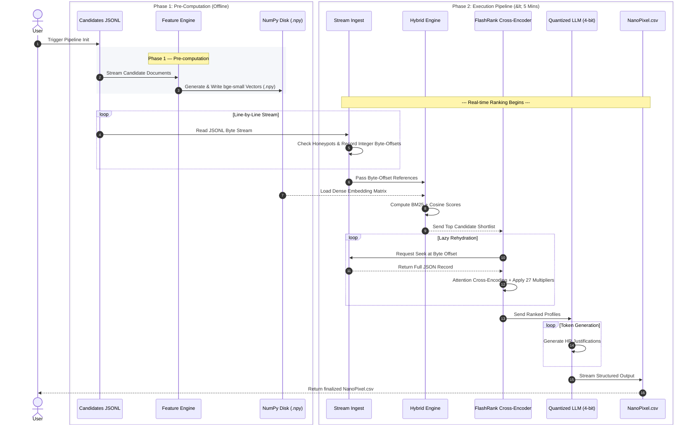

# 🎯 Redrob Candidate Ranking Pipeline — NanoPixel

<p align="center">
  
</p>

<p align="center">
  <a href="#-key-capabilities">Key Features</a> •
  <a href="#-system-architecture">Architecture</a> •
  <a href="#-tech-stack">Tech Stack</a> •
  <a href="#-setup--execution-guide">Quick Start</a> •
  <a href="#-docker-sandbox-execution">Docker</a>
</p>

<p align="center">
  
  
  
  
  
</p>

---

## 🚨 Problem Statement

Traditional Applicant Tracking Systems (ATS) rely on brittle keyword heuristics that reject exceptional candidates over simple vocabulary differences. **NanoPixel** bridges this gap by providing an end-to-end, privacy-first, intelligent candidate ranking engine capable of deep contextual evaluation.

> [!IMPORTANT]
> **Core Objective:** Deliver a high-precision, sub-5-minute candidate shortlist backed by transparent, objective HR justifications—running entirely offline on resource-constrained hardware.

### ⚡ Strict Hackathon Constraints

| Constraint | Limit / Specification | Engineering Solution |
| :--- | :--- | :--- |
| 💻 **Hardware** | Pure Local CPU (Zero GPU) | Quantized GGUF models & vectorized NumPy inference |
| 🧠 **Memory** | $\le$ 16 GiB RAM hard cap | Continuous streaming with integer byte-offset indexing |
| ⏱️ **Latency** | $< 5.0$ minutes wall-clock time | Hybrid retrieval pre-filtering + FlashRank cross-encoding |
| 🔒 **Network** | 100% Offline (Zero external APIs) | Fully self-contained local model weights (`llama.cpp`) |
| 📄 **Output** | Structured CSV output | Streamed CSV writer with dynamically formatted HR feedback |

---

## 🛑 Traditional ATS Bottlenecks vs. 🚀 NanoPixel Engine

```
       ❌ Traditional ATS                          ✅ NanoPixel Engine
┌───────────────────────────────┐          ┌───────────────────────────────┐
│  • Rigid Keyword Matching     │   Vs.    │  • Semantic Vector Alignment  │
│  • Depth & Context Blindness  │  ───►    │  • Cross-Encoder Attention    │
│  • Layout & Parser Fragility  │          │  • Memory-Safe JSON Streaming │
│  • Black-Box Scoring Output   │          │  • Natural Language HR Logic  │
└───────────────────────────────┘          └───────────────────────────────┘
```

<br/>

| Evaluation Pillar | ❌ Traditional ATS Systems | 🚀 NanoPixel Pipeline Solution |
| :--- | :--- | :--- |
| 🧩 **Skill Recognition** | **Brittle Keyword Exactness**<br/>Penalizes candidates over minor phrasing differences (e.g., rejecting *"Frontend"* when looking for *"React"*). | **Semantic Density Alignment**<br/>Uses `bge-small-en-v1.5` embeddings to capture core conceptual expertise regardless of exact wording. |
| 🎯 **Experience Context** | **Impact & Depth Blindness**<br/>Equates high-level architectural design with simple system maintenance. | **Attention-Based Reranking**<br/>Employs `ms-marco-MiniLM-L-12-v2` cross-encoder to evaluate true project depth and contextual fit. |
| ⚡ **System Footprint** | **Memory Bottlenecks**<br/>Crashes or throttles when parsing massive candidate datasets into RAM. | **Byte-Offset Direct Seeking**<br/>Streams `jsonl` data directly from disk using integer byte-offsets without hydrating full datasets into memory. |
| 🔍 **Decision Clarity** | **Arbitrary Black-Box Match Scores**<br/>Outputs unexplained match percentages without actionable feedback. | **Automated HR Justifications**<br/>Generates objective natural language justifications for candidates using a 4-bit `llama-3.2-1b-instruct` local LLM. |

---

## 🏛 System Architecture

The pipeline uses a **two-phase decoupled architecture** designed to isolate heavy embedding generation from real-time execution.

```
                  ┌──────────────────────────────────────────┐
                  │   Phase 1: Pre-Computation (Offline)    │
                  └────────────────────┬─────────────────────┘
                                       │
                         [ candidates.jsonl (Raw) ]
                                       │
                                       ▼
                     ┌────────────────────────────────────┐
                     │     Offline Feature Engine         │
                     │    Model: bge-small-en-v1.5        │
                     └─────────────────┬──────────────────┘
                                       │
                        [ candidate_embeddings.npy ]
                                       │
  ═════════════════════════════════════╧═════════════════════════════════════
                  ┌──────────────────────────────────────────┐
                  │     Phase 2: Online Ranking (<5 Min)     │
                  └────────────────────┬─────────────────────┘
                                       │
                         [ candidates.jsonl (Disk) ]
                                       │
                                       ▼
                     ┌────────────────────────────────────┐
                     │    Stream Ingestion & Filtering    │ ──► Byte-Offset Pointer Array
                     └─────────────────┬──────────────────┘
                                       │
                                       ▼
                     ┌────────────────────────────────────┐
                     │       Hybrid Retrieval Engine      │ ◄── Loads .npy Embeddings
                     │      30% BM25 + 70% Dense Cosine   │
                     └─────────────────┬──────────────────┘
                                       │
                                       ▼ (Top Shortlist)
                     ┌────────────────────────────────────┐
                     │    Lazy-Rehydration & Reranking    │ ──► Direct Disk-Seek
                     │     ms-marco-MiniLM-L-12-v2      │
                     └─────────────────┬──────────────────┘
                                       │
                                       ▼
                     ┌────────────────────────────────────┐
                     │   Deterministic Behavioral Scorer  │ ──► Applies 27 Multipliers
                     └─────────────────┬──────────────────┘
                                       │
                                       ▼
                     ┌────────────────────────────────────┐
                     │ Generative HR Reasoning Engine     │ ──► Local Llama-3.2-1b (CPU)
                     └─────────────────┬──────────────────┘
                                       │
                                       ▼
                            [ NanoPixel.csv Output ]
```

---

## ✨ Key Capabilities

* ⚡ **Constant-Memory Streaming:** Tracks strict 64-bit file byte-offsets, processing 100,000+ candidates without RAM degradation.
* 🎯 **70/30 Hybrid Search:** Merges dense vector semantic density ($70\%$) with C-based BM25 exact keyword matching ($30\%$).
* 🔬 **FlashRank Cross-Encoder:** Performs deep query-document attention scoring to re-rank the top shortlisted candidates.
* 📊 **27 Behavioral Signal Multipliers:** Fine-tunes raw scores against location, notice period, GitHub authority, and tenure stability.
* 🤖 **Local LLM Justifications:** Generates objective HR summaries line-by-line using `llama-3.2-1b-instruct` in 4-bit GGUF format via `llama_cpp`.
* 💻 **Streamlit Dashboard:** Displays latency stats, memory usage curves, candidate profiles, and dynamic output tables in real time.

---

## 📂 Project Structure

```text
 candidate-ranking/
 ├── 📄 app.py                      # Interactive Streamlit dashboard UI
 ├── 🖼️ banner.png                  # Project banner graphic
 ├── ⚡ precompute_features.py      # Offline vector embedding generator
 ├── 🚀 rank.py                     # Primary pipeline execution engine
 ├── 🧪 validate_submission.py      # Output schema & benchmark validator
 │
 ├── 📁 data/                       # Input storage & precomputed arrays
 │   ├── candidate_embeddings.npy   # Serialized dense vector matrix
 │   ├── candidate_ids.json         # Array index-to-ID mappings
 │   └── candidates.jsonl          # Raw streaming dataset
 │
 ├── 📁 pipeline/                   # Core modular execution logic
 │   ├── __init__.py                # Package initialization
 │   ├── config.py                  # Global hyperparameters & model configs
 │   ├── filters.py                 # 9 Honeypot safety heuristics
 │   ├── reasoning.py               # Local GGUF LLM orchestration
 │   ├── scoring.py                 # Behavioral heuristic multipliers
 │   └── text_builder.py            # Prompt construction utilities
 │
 ├── 📁 must_read/                  # Reference documents & JSON schemas
 │   ├── candidate_schema.json
 │   ├── job_description.md
 │   └── redrob_signals_doc.md
 │
 ├── 📁 generated/                  # Pipeline output directory
 │   └── NanoPixel.csv              # Final ranked candidates & reasoning
 │
 └── 📁 weights/                    # Local offline model weights
     ├── bge-small-en-v1.5/         # Dense retrieval model
     ├── llama-3.2-1b-instruct-q4_k_m.gguf # 4-bit quantized generative LLM
     └── ms-marco-MiniLM-L-12-v2/   # Reranking cross-encoder model
```

---

## 🧠 Engineering Trade-Offs

#### 1. Why File Byte-Offsets over Pandas / Polars?
> Loading a 500MB+ JSONL dataset alongside ML model weights in memory easily triggers Linux OOM killers. By keeping an array of integer byte-positions in RAM (~MBs), the engine performs $O(1)$ disk seeks to rehydrate candidate JSONs only when needed.

#### 2. Why a 70/30 Dense-Sparse Hybrid Search?
> Dense semantic models excel at understanding roles (e.g., mapping *"Backend Developer"* to *"API Architect"*), but struggle with exact framework versions or niche tool identifiers. Combining dense similarity ($70\%$) with lexical BM25 ($30\%$) ensures high candidate recall prior to heavy cross-encoding.

#### 3. Why 4-Bit GGUF (`llama-3.2-1b`) on CPU?
> To strictly obey the offline requirement without GPU acceleration, `llama-3.2-1b-instruct` quantized to `q4_k_m` consumes only ~1.1 GiB RAM. Executed via C++ bindings (`llama_cpp`), it achieves fast token generation on modern multicore CPUs.

---

## 🔄 Sequence Workflow



---

## 🚀 Setup & Execution Guide

### 1. Installation

```bash
# Clone repository
git clone https://github.com/PushpakKumar12a/Candidate-Ranking.git
cd Candidate-Ranking

# Create & activate virtual environment
python -m venv venv
source venv/bin/activate  # Windows: venv\Scripts\activate

# Install dependencies
pip install -r requirements.txt
```

### 2. Pre-Computation (Offline Step)

Generates dense embeddings for candidates prior to real-time ranking:

```bash
python precompute_features.py
```

### 3. Execute Candidate Ranking Pipeline

Run the end-to-end pipeline under strict constraints:

```bash
python rank.py --candidates ./data/candidates.jsonl --out ./generated/NanoPixel.csv
```

### 4. Launch Streamlit Dashboard

Explore rankings, memory consumption, and reasoning summaries interactively:

<p align="center">
  
</p>

```bash
streamlit run app.py
```

---

## 🐳 Docker Sandbox Execution

Run the complete pipeline inside a memory-capped, isolated container enforcing a strict 16 GiB RAM limit:

```bash
# 1. Pull container image
docker pull pushpakkumar/talentforge

# 2. Run container with strict memory boundaries
docker run -d \
  -p 127.0.0.1:8501:8501 \
  --memory="16g" \
  --name talentforge \
  pushpakkumar/talentforge
```

> [!NOTE]
> Access the Streamlit dashboard locally by opening [`http://localhost:8501`](http://localhost:8501) in your browser.
