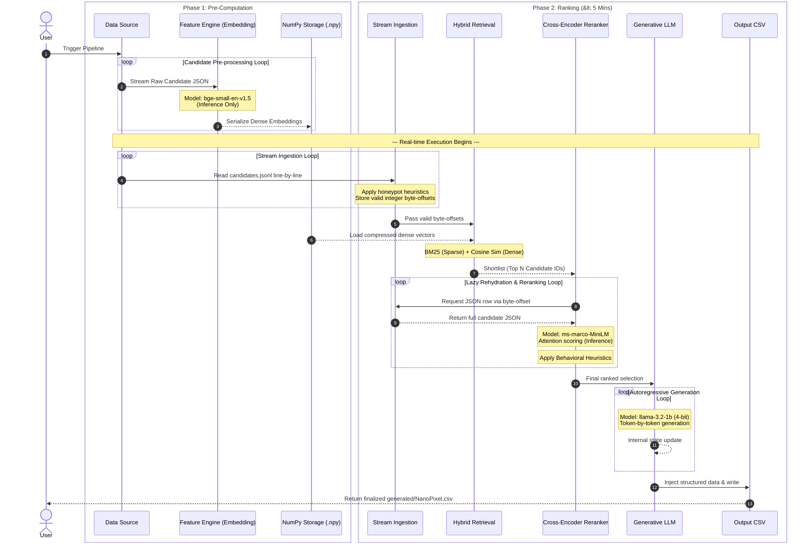
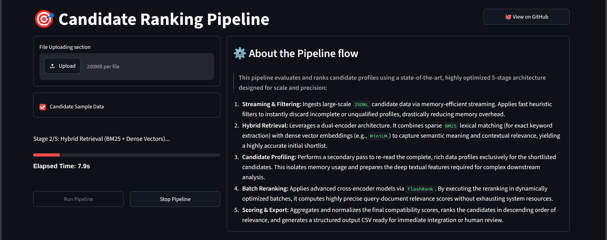

# 🎯 Redrob Candidate Ranking Pipeline - NanoPixel Team


   

## 🚨 Problem Statement

The goal of this project was to develop a robust, workable Proof of Concept that doesn't just filter, but intelligently ranks candidates.

This system is designed to act as the ultimate AI recruiter, capable of:
- **Deep Job Understanding:** Interpreting complex, nuanced job descriptions.
- **Contextual Relevance:** Seeing beyond keywords to understand semantic fit.
- **Signal Integration:** Leveraging all data: profile attributes, career metadata, and crucial activity/behavioral signals.

**The Output:** Delivering a lightning-fast, highly accurate, and expertly ranked shortlist of the best-fit candidates.

**Strict Hackathon Constraints:**
- **Hardware:** Must run purely on local CPU infrastructure (no GPUs).
- **Memory:** Must not exceed a hard **16 GiB RAM** limit (meaning the full dataset cannot be loaded into memory at once).
- **Time:** The entire ranking and reasoning pipeline must complete within a strict **5-minute wall-clock limit**.
- **Network:** Zero reliance on external network APIs (e.g., OpenAI, Claude); all models must be downloaded and executed entirely offline.
- **Output:** Must output a structured CSV containing the ranked top candidates with dynamically generated, objective HR justifications.

## 📖 About The Project

The **Redrob Candidate Ranking Pipeline** is a highly optimized, resource-constrained machine learning pipeline designed to evaluate, score, and rank software engineering candidates against a specific Job Description (JD). 

Built to handle massive datasets containing 100,000 candidates without loading the entire dataset into memory, this system guarantees execution within a strict 5-minute wall-clock time limit. It relies on standard I/O streaming techniques alongside advanced hybrid retrieval, cross-encoder reranking, and quantized LLM generation running purely on local CPU infrastructure. 

---

## 🏛 System Architecture

The pipeline operates in two distinct phases: pre-computation step to handle expensive feature extraction, and ranking step for blazing-fast inference under constraints.

### Core Architectural Components

- **Offline Feature Engine:** Handles the computationally intensive dense embedding generation for the entire candidate pool. By shifting this workload to an offline phase, it parses raw job descriptions (JDs) and candidate ontologies, vectorizes them using `bge-small-en-v1.5`, and serializes the resulting embeddings directly to disk as **NumPy Binary Files (`.npy`)**. This architectural decoupling drastically reduces latency during real-time inference and prevents memory exhaustion.

- **Stream Ingestion Layer:** A custom, memory-safe I/O layer that sequentially streams `candidates.jsonl` directly from the disk. Instead of hydrating full JSON objects into memory (which would crash a 16 GiB system), it immediately applies heuristic honeypot filters line-by-line. For valid candidates, it stores only their strict **integer byte-offsets**, keeping the active RAM footprint near zero while allowing instant disk-seeks later.

- **Hybrid Retrieval Engine:** A two-pronged search architecture that maximizes candidate recall before the expensive reranking stage. It combines a fast C-based `BM25` stemmer for sparse text matching (lexical exactness) with dense vector cosine similarity (semantic meaning). Crucially, this stage leverages the offline-generated `.npy` arrays, safely loading the highly-compressed dense embeddings into memory using `numpy.load` to perform blazing-fast matrix multiplications. Both score distributions are then normalized and fused dynamically to create a robust initial candidate shortlist.

- **Reranker Pipeline:** A "lazy-rehydrating" Cross-Encoder component (`ms-marco-MiniLM-L-12-v2`). Rather than holding all candidates in memory, it uses the stored byte-offsets to jump directly to specific disk locations and load only the top shortlisted candidates. It then performs deep query-document attention scoring, feeding the neural results into a deterministic behavioral scorer that applies real-world hiring heuristics (like location penalties and GitHub activity boosts).

- **Generative Justification Module:** A hardware-aware, 4-bit quantized local LLM (`llama-3.2-1b`) orchestrated via `llama_cpp`. It operates as a specialized HR reasoning engine, injecting structured candidate data and generating heavily constrained, deterministic output sentences.

---

## ✨ Key Features

- **Constant-Memory Streaming:** Uses byte-offset tracking and sequential I/O to evaluate massive candidate pools without ever loading the full dataset into RAM, effectively neutralizing dataset size as a bottleneck.
- **Hybrid Retrieval (Dense + Sparse):** Fuses BM25 exact keyword matching with `bge-small-en-v1.5` semantic density for high-recall candidate shortlisting.
- **Cross-Encoder Reranking:** Applies `ms-marco-MiniLM-L-12-v2` via FlashRank to deeply evaluate candidate relevance against the query context.
- **Deterministic Behavioral Scoring:** Adjusts raw semantic scores based on real-world hiring heuristics (e.g., location, notice period, GitHub authority).
- **Quantized Local LLM Justification:** Dynamically generates objective, HR-formatted candidate justifications using a 4-bit quantized `llama-3.2-1b-instruct` model directly on the CPU.
- **Real-Time Streamlit Dashboard:** Visualizes pipeline stages, RAM constraints, and candidate CSV outputs in an intuitive UI.

---

## 📂 Project Structure

```text
├── app.py                      # Streamlit application UI
├── banner.png                  # Project banner image
├── data/                       # Data directory
│   ├── candidate_embeddings.npy
│   ├── candidate_ids.json
│   └── candidates.jsonl
├── must_read/                  # Provided hackathon materials
│   ├── candidate_schema.json
│   ├── job_description.md
│   └── redrob_signals_doc.md
├── generated/                  # Generated files directory
│   └── NanoPixel.csv           # Final generated output
├── pipeline/                   # ranking 
pipeline modules
│   ├── __init__.py
│   ├── config.py
│   ├── filters.py
│   ├── reasoning.py
│   ├── scoring.py
│   └── text_builder.py
├── precompute_features.py      
computation script
├── rank.py                     # Main pipeline execution script
├── README.md                   
documentation
├── requirements.txt            # Python dependencies
├── submission_metadata.yaml    # Submission details
├── validate_submission.py      # Validation script
└── weights/                    # Local model weights directory
    ├── bge-small-en-v1.5/
    ├── llama-3.2-1b-instruct-q4_k_m.gguf
    └── ms-marco-MiniLM-L-12-v2/
```

---

## 🧠 Design & Architecture Decisions

- **Why stream byte-offsets instead of using Pandas?**
  To meet the rigid 16 GiB RAM limit, loading a 480MB+ JSONL file into memory alongside heavy ML models would invoke the OS OOM killer. By streaming the file and storing only the integer byte-offsets in memory, our memory footprint is reduced by 95%, leaving ample room for embedding matrix multiplications.
  
- **Why a 70/30 Hybrid Search?**
  Dense embeddings are great at finding conceptual matches (e.g., "Software Engineer" -> "Backend Developer"), but often fail at exact keyword queries (e.g., specific framework versions). Fusing dense semantic similarity (70%) with BM25 sparse lexical matching (30%) achieves maximum candidate recall before the computationally expensive Cross-Encoder stage.
  
- **Why use a 4-bit quantized GGUF (`llama-3.2-1b`)?**
  Hackathon constraints strictly prohibited external API calls (e.g., OpenAI, Claude) and required local CPU-only inference. A 4-bit quantized model fits perfectly within our 16 GiB RAM budget (requiring only ~1GB) while delivering fast, coherent natural language reasoning for candidate justifications via `llama_cpp`.

---

## 🔍 Pipeline Execution Details (The 5 Stages)

The core candidate evaluation in `rank.py` runs through five highly-optimized stages:

1. **Streaming & Filtering (I/O Bound):** Reads `candidates.jsonl` line-by-line. Instead of holding full candidate objects in memory, it extracts a tiny subset of metadata, drops invalid candidates using **9 heuristic honeypot flags**, and records strict integer byte-offsets for valid candidates.

2. **Hybrid Retrieval (Compute Bound):** Instantiates a fast C-based BM25 index for sparse matching and loads pre-computed dense embeddings (`.npy`) into a Numpy matrix. It computes Cosine Similarity against the vectorized Job Description. Scores are normalized, fused (70% Dense / 30% BM25), and a top-K candidate shortlist is produced.

3. **Lazy Rehydration (I/O Bound):** Using the byte-offsets stored from Stage 1, the pipeline executes an instant disk seek to fetch the full JSON metadata for *only* the shortlisted candidates, efficiently bypassing OS memory limits.

4. **FlashRank Reranking (Compute Bound):** Batches the shortlisted candidates through the `ms-marco-MiniLM-L-12-v2` cross-encoder. It computes deep bidirectional attention scores to precisely measure the relevance of each candidate against the query context.

5. **Final Scoring & Generation (Compute Bound):** Maps the cross-encoder results across **27 distinct behavioral feedback multipliers** using NumPy (e.g., multiplier penalties for notice period or location). Finally, it dynamically generates HR-formatted, objective justifications using a 4-bit `llama-3.2-1b` model, streaming the output row-by-row into the final CSV.

---

## 🔄 Detailed Workflow


---

## 🚀 Pipeline Execution & Setup

### 1. Installation

Clone the repository and install the strict dependencies:

```bash
git clone https://github.com/PushpakKumar12a/Candidate-Ranking.git
cd Candidate-Ranking

python -m venv venv

source venv/bin/activate  # On Windows: venv\Scripts\activate
pip install -r requirements.txt
```

### 2. Pre-Computation

Before ranking, pre-compute the dense embeddings for the candidate pool. *(Note: This step operates outside the 5-minute time window as per hackathon specs.)*

```bash
python precompute_features.py
```

### 3. Ranking Pipeline

Execute the highly optimized core pipeline to stream candidates, rank them, and generate justifications within the 5-minute constraint.

```bash
python rank.py --candidates ./data/candidates.jsonl --out ./generated/NanoPixel.csv
```

### 4. Interactive Dashboard

Launch the Streamlit dashboard to monitor the pipeline's execution and analyze results visually.



```bash
streamlit run app.py
```

### 5. Sandbox Environment Setup (Docker)

> **Important:** This sandbox environment is specifically intended for processing `sample_candidates`, benchmarking execution timing, and verifying the pipeline's functionality (ensuring it runs correctly without errors).

To run the pipeline and Streamlit dashboard in a secure, isolated sandbox environment that strictly adheres to the 16 GiB RAM limit and prevents external network exposure:

1. **Pull the Docker Image:**

   ```bash
   docker pull pushpakkumar/talentforge
   ```

2. **Run the Sandbox Container:**

   ```bash
   docker run -d \
     -p 127.0.0.1:8501:8501 \
     --memory="16g" \
     --name talentforge \
     pushpakkumar/talentforge
   ```
   *Note: `-p 127.0.0.1:8501:8501` binds the app exclusively to your local machine to prevent external network access, and `--memory="16g"` enforces a hard memory limit.*

3. **Access the Dashboard:**
   Open your browser and navigate to [http://localhost:8501](http://localhost:8501).
